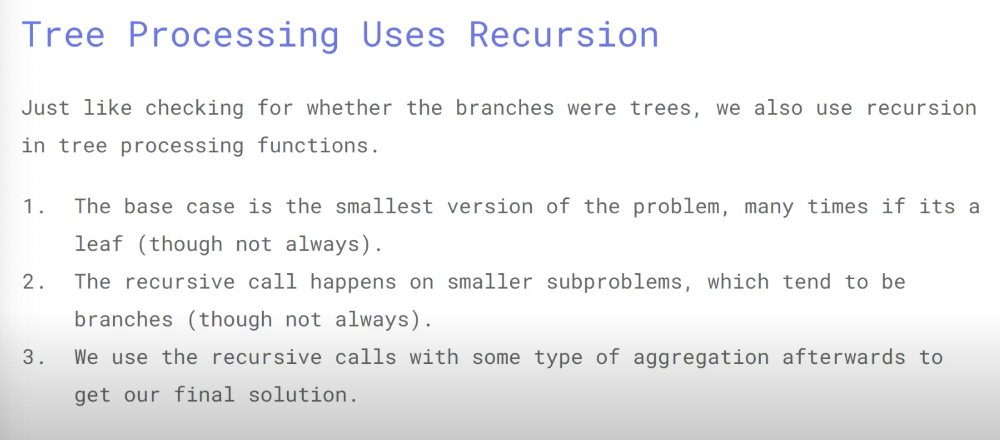

# CS61A (Python)

- How to run doctest in Python
	- if python3 -m doctest ...py is not working
	- try python3 -m doctest -v ...py

## Lecture 10

### Sequence Aggregation

- any(iterable) -> bool
- all(iterable) -> bool

a = [1,2,3] 
a1 = [0,1,2,3]

all(a) -> True   

all(a1) -> False   

any(a1) - >True   

### Tree Abstraction

### Tree Processing

*code in class* tree.py

